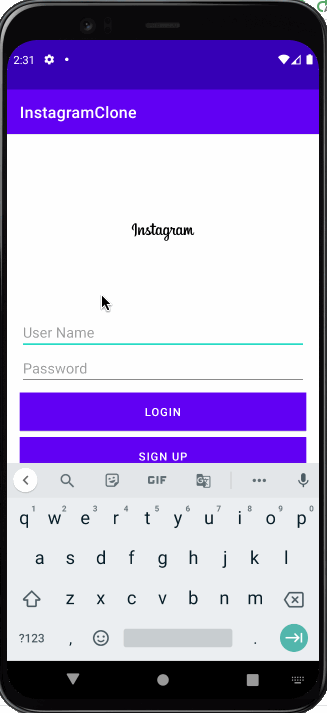
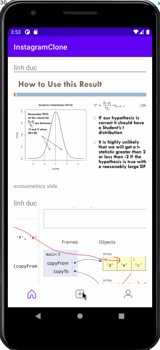

# Instagram Clone - Part 1

Instagram Clone is a photo sharing app similar to Instagram but using Parse as its backend.

Language used: Java

## User Stories

The following **required** functionality is completed:

- [x] User can sign up to create a new account using Parse authentication.
- [x] User can log in and log out of his or her account.
- [x] The current signed in user is persisted across app restarts.
- [x] User can take a photo, add a caption, and post it to "Instagram".

The following **optional** features is implemented:

- [x] User sees app icon in home screen and styled bottom navigation view

## Video Walkthrough

Here's a walkthrough of implemented user stories:

 

GIF created with [LiceCap](http://www.cockos.com/licecap/).

## Open-source libraries used

- [Android Async HTTP](https://github.com/codepath/CPAsyncHttpClient) - Simple asynchronous HTTP requests with JSON parsing
- [Glide](https://github.com/bumptech/glide) - Image loading and caching library for Android

-----------------------------------
# Instagram Clone - Part 2

## User Stories

The following **required** functionality is completed:

- [x] User can view the last 20 posts submitted to "Instagram".
- [x] The user should switch between different tabs - viewing all posts (feed view), compose (capture photos form camera) and profile tabs (posts made) using fragments and a Bottom Navigation View. (2 points)
- [x] User can pull to refresh the last 20 posts submitted to "Instagram".

The following **optional** feature is implemented:

- [x] User sees app icon in home screen and styled bottom navigation view

## Video Walkthrough

Here's a walkthrough of implemented user stories:

 

GIF created with [LiceCap](http://www.cockos.com/licecap/).

## License
This is a project from CodePath Android app development course.
